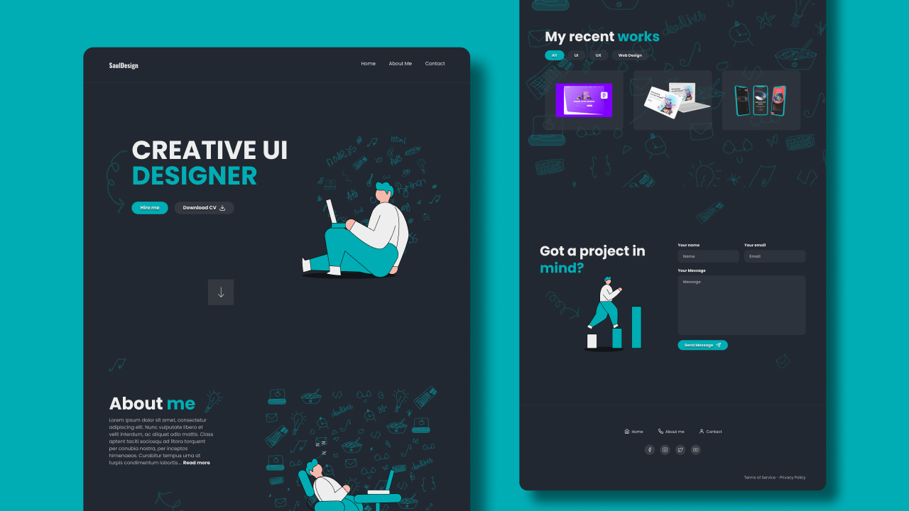

# ️🐿️ Visit site: [link](https://designer.comatose.life)
Landing website for a designer in minimalism with easy editing options. This is one of my first independent works, thank you! I would be grateful for any suggestions to improve the code

##

# 🐢 Additional Information:

## 🍇 I learn:
- ⭐ Positioning elements with `grid/flex` box
- 🌵 Absolute positioning
- 🐌 Styling forms
- 🌷 Semantic HTML
- 🏠 Working with SVG
- ✈️ And more other

## 📌 RoadMap
1. Creating Interactive actions
2. Make adaptive